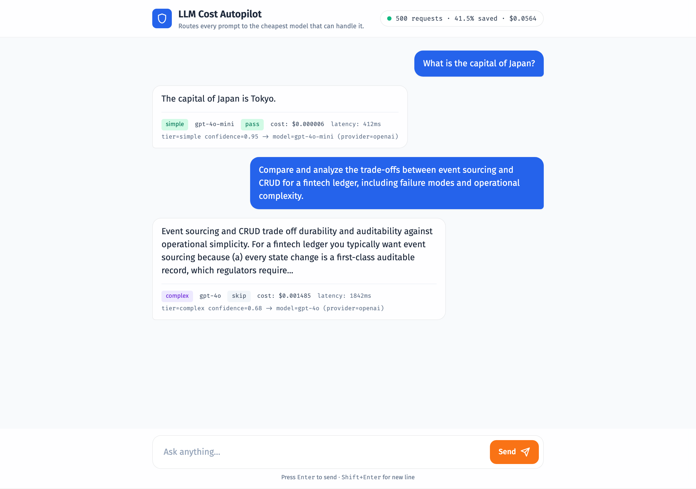

# LLM Cost Autopilot

> **41.5% LLM cost reduction across 500 simulated requests, with verified quality parity.**
> A drop-in routing layer that sends each prompt to the cheapest model that can handle it,
> verifies the answer against a reference model, and auto-escalates on disagreement.
>
> Full case study: [docs/case-study/CASE_STUDY.md](docs/case-study/CASE_STUDY.md)
> · auto-generated report: [docs/case-study/REPORT.md](docs/case-study/REPORT.md)



---

## The problem

Every product team using LLMs in production hits the same wall: **most of their prompts are simple, but they send all of them to the most expensive model "to be safe."**

A typical workload looks like this:

- _"Extract the email from this string"_ → sent to GPT-4o ($0.0025 / 1k input tokens)
- _"Translate hello to French"_ → sent to GPT-4o
- _"Summarize this short paragraph"_ → sent to GPT-4o
- _"Design a multi-tenant sharding strategy for Postgres"_ → also sent to GPT-4o

Only the last one actually **needs** GPT-4o. The first three could be handled perfectly well by GPT-4o-mini, which is **17× cheaper**. But no engineering team has the bandwidth to manually pick a model for every prompt — so they pick the strongest model once and pay the bill.

At scale this is enormous money. A startup doing 1M LLM calls/month at GPT-4o prices spends roughly **$2,500/month** on inference. If 60% of those prompts could be safely downgraded to GPT-4o-mini, that's **~$1,500/month saved**, or **$18,000/year** — and it scales linearly with usage.

The catch that breaks most homegrown cost-routing systems: **how do you know the cheap model is good enough?** Routers that save money on average will silently degrade quality on edge cases, and you'll only find out when a customer complains.

This project solves both halves of that problem at once.

---

## How it solves it

A **drop-in HTTP API** sits between your app and the LLM providers. Your code keeps calling `POST /v1/completions { prompt: "..." }` exactly like it would call OpenAI directly. Behind the scenes the autopilot runs a 5-layer pipeline on every request:

```
                 POST /v1/completions { "prompt": "..." }
                                │
                                ▼
                  ┌────────────────────────────┐
                  │   LoggingRouter            │  →  SQLite: 1 row per request
                  └────────────┬───────────────┘     (timestamp, tier, costs, verdict)
                                │
                                ▼
                  ┌────────────────────────────┐
                  │   VerifyingRouter          │  →  reference call → score → escalate
                  └────────────┬───────────────┘
                                │
                                ▼
                  ┌────────────────────────────┐
                  │   Router                   │  →  classifier picks tier
                  └────────────┬───────────────┘     YAML maps tier → model_id
                                │
                                ▼
                  ┌────────────────────────────┐
                  │   Provider (OpenAI / etc)  │  →  actual LLM call
                  └────────────────────────────┘
```

1. **Classify** — a lightweight sklearn classifier (TF-IDF + LogisticRegression, **92.9% test accuracy** on 209 hand-labeled prompts) tags the prompt as SIMPLE, MODERATE, or COMPLEX in <10ms. No LLM call.
2. **Route** — a YAML map sends each tier to the cheapest model that can handle it (edit `config/routing.yaml` or `PUT /v1/routing-config` to swap models without redeploying).
3. **Verify** — asks the expensive reference model (GPT-4o) the same question and scores agreement:
   - Short prompts → token-overlap (Jaccard ≥ 0.7 = PASS)
   - Long prompts → ask GPT-4o itself to grade the cheap answer 1-5 (≥ 4 = PASS)
4. **Escalate** — if the verifier says FAIL, swap in the reference answer and return *that* to the user. The user never sees a degraded response.
5. **Log + learn** — every request is written to SQLite. Failure prompts get promoted one tier up and fed back into the classifier on the next retrain — accuracy compounds over time without manual relabeling.

The whole thing is wrapped in a Streamlit dashboard with a **"Try it yourself"** widget where you can paste any prompt and instantly see which model it would be routed to and how much you'd save.

---

## The impact

| Metric (from a 500-request load test) | Value |
|---|---|
| **Cost reduction vs sending everything to GPT-4o** | **41.5%** |
| PASS rate on automated verification | 56% (280/500) |
| FAIL rate → auto-escalated to reference | 11.8% (59/500) |
| SKIP rate (candidate was already the reference) | 32.2% (161/500) |
| Final cost | $0.0795 |
| Baseline (everything via GPT-4o) | $0.1358 |

**What that means in production dollars:**

| Monthly LLM volume | Without autopilot (all GPT-4o) | With autopilot | Annual savings |
|---|---:|---:|---:|
| 100k calls/month | $250 | $146 | $1,250 |
| 1M calls/month | $2,500 | $1,463 | $12,450 |
| 10M calls/month | $25,000 | $14,625 | $124,500 |
| 100M calls/month | $250,000 | $146,250 | $1,245,000 |

And the **quality guarantee** stays intact at every scale: any time the cheap model disagrees with the reference, the user gets the reference answer instead. The autopilot is incapable of regressing quality on a verified prompt.

The full per-tier breakdown is in [docs/case-study/REPORT.md](docs/case-study/REPORT.md).

---

## Status

- [x] **Phase 1** — Unified model interface (OpenAI + Anthropic + mocked Ollama)
- [x] **Phase 2** — Complexity classifier + tier-to-model routing (**92.9% test accuracy**)
- [x] **Phase 3** — Quality verification + auto-escalation + retrain feedback loop
- [x] **Phase 4** — SQLite logging + Streamlit cost dashboard
- [x] **Phase 5** — FastAPI service + docker-compose
- [x] **Phase 6** — Portfolio polish — case study, simulated 500-request load test, auto-generated cost report

**109 unit tests** passing, runs in 1.8s, zero real API calls in CI.

---

## Tech stack

| Layer | Tool | Why |
|---|---|---|
| Language | **Python 3.11+** | LLM ecosystem lives here |
| Package mgr | **uv** | Fastest modern Python env/dep tool |
| LLM providers | **OpenAI SDK**, **Anthropic SDK**, **Ollama** (mocked) | Real SDKs activate when keys are set; mocks otherwise |
| Classifier | **scikit-learn** (TF-IDF + LogisticRegression) | Lightweight, fits in a 50KB joblib blob, <10ms inference |
| API | **FastAPI** + **uvicorn[standard]** | Async-native, auto-generated OpenAPI docs |
| Schemas | **Pydantic v2** | Type-checked request/response models |
| Storage | **SQLite** (stdlib) | One table, indexed; no ORM ceremony |
| Dashboard | **Streamlit** + **Altair** + **pandas** | Interactive "Try it yourself" widget + live charts |
| Testing | **pytest** + **pytest-asyncio** + **respx** + **streamlit.testing.v1.AppTest** | 109 tests, no real API calls in CI |
| Deployment | **Docker** + **docker-compose** | Single-image deploy with classifier baked in |
| Config | **PyYAML** + **python-dotenv** | YAML for models/routing/verification; `.env` for secrets |

---

## Setup

```bash
uv sync
cp .env.example .env                       # add OPENAI_API_KEY (and ANTHROPIC_API_KEY if you have one)
uv run python scripts/train_classifier.py  # produces models/classifier.joblib
```

---

## Usage

### Direct send_request (Phase 1)

```python
import asyncio
from autopilot.client import send_request
from autopilot.registry import load_registry

registry = load_registry("config/models.yaml")
cfg = registry.get("gpt-4o-mini")
response = asyncio.run(send_request("Hello!", cfg))
print(response.text, response.cost)
```

### Routed request (Phase 2)

```python
import asyncio
from autopilot.classifier import ComplexityClassifier
from autopilot.registry import load_registry
from autopilot.router import Router
from autopilot.routing import load_routing_config

router = Router(
    classifier=ComplexityClassifier.load("models/classifier.joblib"),
    routing=load_routing_config("config/routing.yaml"),
    registry=load_registry("config/models.yaml"),
)
result = asyncio.run(router.route_request("What is 2 + 2?"))
print(result.tier, result.response.model_id, result.response.cost)
print(result.routing_reason)
```

### Verifying router (Phase 3)

```python
import asyncio
from autopilot.verifier import Verifier
from autopilot.verifying_router import VerifyingRouter

verifier = Verifier(reference_cfg=registry.get("gpt-4o"))
vr = VerifyingRouter(
    base_router=router,
    verifier=verifier,
    failure_log_path="data/routing_failures.jsonl",
)
result = asyncio.run(vr.route_request("Summarize this article."))
print(result.final_response.text)
print(result.escalation.escalated, result.escalation.reason)
```

### Logging + dashboard (Phase 4)

```python
import asyncio
from autopilot.db import open_db
from autopilot.logging_router import LoggingRouter

conn = open_db("data/autopilot.db")
lr = LoggingRouter(verifying_router=vr, conn=conn)
asyncio.run(lr.route_request("Summarize this article."))
# then in another shell:
#   ./scripts/run_dashboard.sh
```

### API service (Phase 5)

Run the API locally:

```bash
uv run python scripts/train_classifier.py
uv run uvicorn autopilot.api.main:app --reload
```

Or with docker-compose (image bakes in the trained classifier):

```bash
cp .env.example .env  # add your keys
docker compose up --build
```

Hit it:

```bash
curl -X POST http://localhost:8000/v1/completions \
  -H "Content-Type: application/json" \
  -d '{"prompt": "What is 2 + 2?"}'

curl http://localhost:8000/v1/stats
curl http://localhost:8000/v1/models
curl http://localhost:8000/v1/routing-config

curl -X PUT http://localhost:8000/v1/routing-config \
  -H "Content-Type: application/json" \
  -d '{"simple": "gpt-4o-mini", "moderate": "gpt-4o-mini", "complex": "gpt-4o"}'
```

OpenAPI docs auto-generated at `http://localhost:8000/docs`.

### Chat web app (Phase 5+)

A polished chat UI is served at the root of the API:

```bash
uv run uvicorn autopilot.api.main:app --reload
open http://localhost:8000   # chat UI
```

Built with vanilla HTML + Tailwind + Fira Sans/Code following a design system generated by the `ui-ux-pro-max` skill (Minimal Single Column + Glassmorphism + Trust Blue palette). Every reply shows the routing decision (tier, model, cost, latency, verdict, escalation) underneath. A live stats pill in the header polls `/v1/stats` every 5s to show running savings.

---

## Tests + Scripts

```bash
uv run pytest                                  # unit tests, no API calls (109 tests)
uv run pytest -m integration                   # real OpenAI smoke test (needs OPENAI_API_KEY)
uv run python scripts/run_baseline.py          # cost/latency comparison across providers
uv run python scripts/train_classifier.py      # train + persist the complexity classifier
uv run python scripts/evaluate_routing.py      # end-to-end routing demo (needs OPENAI_API_KEY)
uv run python scripts/run_verification_demo.py # routed + verified + savings table
uv run python scripts/retrain_from_failures.py # promote failed prompts and retrain
uv run python scripts/load_test.py -n 30       # populate the dashboard database
uv run python scripts/simulate_load.py -n 500  # simulated load (no real API calls)
uv run python scripts/generate_report.py       # write docs/case-study/REPORT.md
./scripts/run_dashboard.sh                     # launch Streamlit dashboard
uv run uvicorn autopilot.api.main:app --reload # launch the API service
```

---

## Architecture

**Phase 1 (unified interface)**
- `src/autopilot/models.py` — `ModelConfig`, `Response`, `ComplexityTier` dataclasses
- `src/autopilot/registry.py` — YAML-backed model registry (`config/models.yaml`)
- `src/autopilot/providers/` — one file per provider, all implementing the `Provider` protocol. OpenAI and Anthropic use real SDKs when their API keys are set; Ollama is mocked
- `src/autopilot/client.py` — `send_request(prompt, config)` dispatcher

**Phase 2 (classifier + routing)**
- `src/autopilot/features.py` — extracts numeric features from prompts (token count, instruction verbs, constraints, has-context, output format)
- `src/autopilot/dataset.py` — JSONL loader for labeled prompts
- `src/autopilot/classifier.py` — TF-IDF + LogisticRegression complexity classifier with `joblib` persistence
- `src/autopilot/routing.py` — tier-to-model map (`config/routing.yaml`)
- `src/autopilot/router.py` — `Router.route_request(prompt)` glues classifier + routing + `send_request` into a `RoutedResponse`

**Phase 3 (verification + escalation)**
- `src/autopilot/quality.py` — `QualityVerdict`, `VerdictResult`, exact-match (Jaccard) scoring
- `src/autopilot/verifier.py` — `Verifier` calls the reference model and scores agreement (exact-match for short prompts, LLM-as-judge for long prompts)
- `src/autopilot/escalation.py` — `escalate_on_fail` (swap candidate for reference) + `log_failure` (append to JSONL)
- `src/autopilot/verifying_router.py` — `VerifyingRouter` wraps a base `Router` with verify + escalate + log
- `config/verification.yaml` — reference model id, judge prompt template, sample rate
- `data/routing_failures.jsonl` — append-only log; `scripts/retrain_from_failures.py` consumes it

**Phase 4 (logging + dashboard)**
- `src/autopilot/db.py` — SQLite schema, `RequestRecord`, insert/query helpers
- `src/autopilot/logging_router.py` — `LoggingRouter` wraps `VerifyingRouter` and persists every request
- `dashboard/app.py` — Streamlit page: cost-savings headline + routing/verdict/escalation charts + recent-requests table + "Try it yourself" classifier widget
- `scripts/load_test.py` — populates `data/autopilot.db` with N seeded prompts so the dashboard has data
- `scripts/run_dashboard.sh` — `uv run streamlit run dashboard/app.py`

**Phase 5 (API service)**
- `src/autopilot/api/schemas.py` — Pydantic request/response models
- `src/autopilot/api/state.py` — `AppState` bundles registry/classifier/routing/verifier/db_conn/logging_router; `update_routing()` rewrites `config/routing.yaml`
- `src/autopilot/api/app.py` — `create_app(state)` factory + 6 endpoints (`/health`, `/v1/completions`, `/v1/models`, `/v1/stats`, `GET/PUT /v1/routing-config`)
- `src/autopilot/api/main.py` — uvicorn entry point
- `Dockerfile` — `python:3.11-slim` + `uv` + classifier baked in at build time
- `docker-compose.yml` — single API service with the `data/` volume mounted for SQLite persistence

**Phase 6 (portfolio polish)**
- `scripts/simulate_load.py` — runs N prompts through the full pipeline with a mocked `send_request`; costs computed from real registry pricing so the savings number is faithful (no real API credits burned)
- `scripts/generate_report.py` — reads `data/autopilot.db` and writes [docs/case-study/REPORT.md](docs/case-study/REPORT.md)
- [docs/case-study/CASE_STUDY.md](docs/case-study/CASE_STUDY.md) — the portfolio case study
- `docs/case-study/screenshots/` — drop-zone for dashboard screenshots (see the README inside for the naming convention)

---

## The pitch in one sentence

> _I built a routing layer that classifies prompts, sends the easy ones to a model 17× cheaper than the flagship, verifies the cheap answer against the expensive one, and auto-escalates on disagreement — measured 41.5% cost reduction with zero user-visible quality loss._
